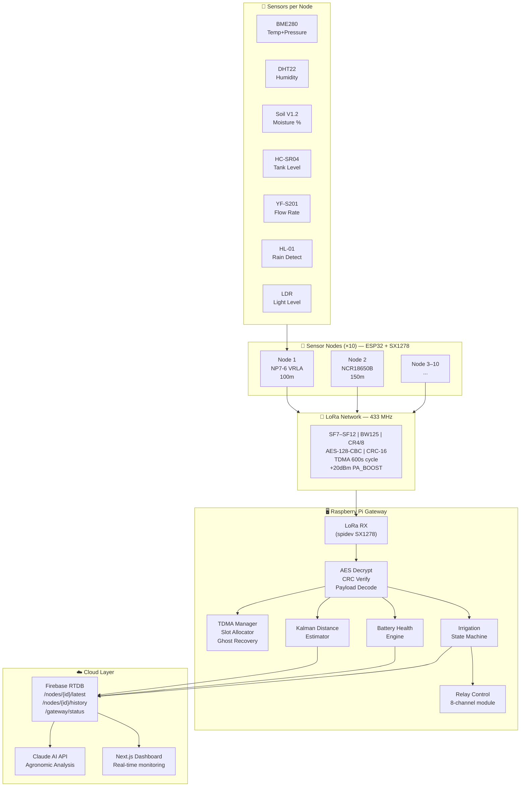
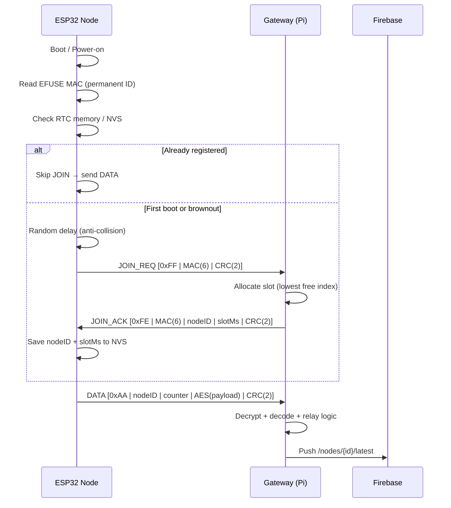
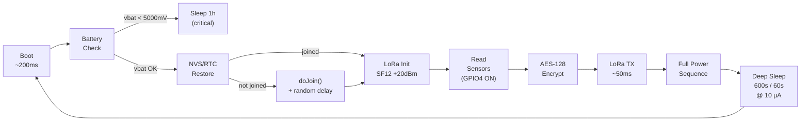
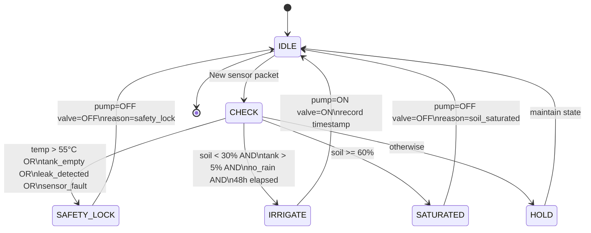

<div align="center">


&nbsp;&nbsp;

&nbsp;&nbsp;

&nbsp;&nbsp;


# AgroSafe-IoT

### Secured IoT Platform for Smart Agricultural Irrigation

[](LICENSE)
[](https://www.espressif.com/)
[](#)
[](#)
[](https://firebase.google.com/)
[](#)
[](#field-test-results)

> **End-to-end secured IoT network for precision agriculture** — 10 autonomous sensor nodes communicating over LoRa 433 MHz with AES-128-CBC encryption, custom TDMA scheduling, and real-time Firebase cloud integration. Validated in field conditions at 150 m through vegetation with SF12.

</div>

---

## Table of Contents

- [System Overview](#system-overview)
- [Architecture](#architecture)
  - [Full Stack Diagram](#full-stack-diagram)
  - [Node Internal Architecture](#node-internal-architecture)
  - [Gateway Architecture](#gateway-architecture)
  - [Protocol Stack](#protocol-stack)
- [Hardware](#hardware)
  - [Sensor Nodes](#sensor-nodes-esp32--sx1278)
  - [Central Gateway](#central-gateway-raspberry-pi)
  - [Bill of Materials](#bill-of-materials)
- [Firmware — ESP32 Nodes](#firmware--esp32-nodes)
  - [TDMA Protocol](#tdma-protocol)
  - [AES-128-CBC Encryption](#aes-128-cbc-encryption)
  - [Payload Format](#payload-format)
  - [Power Management](#power-management)
  - [Adaptive TX Power](#adaptive-tx-power)
  - [NVS Brownout Recovery](#nvs-brownout-recovery)
- [Gateway — Python](#gateway--python)
  - [Packet Pipeline](#packet-pipeline)
  - [Kalman Distance Estimation](#kalman-distance-estimation)
  - [Battery Health Engine](#battery-health-engine)
  - [Irrigation State Machine](#irrigation-state-machine)
- [Cloud Integration](#cloud-integration)
  - [Firebase Data Structure](#firebase-data-structure)
  - [AI Analysis](#ai-analysis)
- [Field Test Results](#field-test-results)
  - [RF Link Quality](#rf-link-quality)
  - [Battery Comparison](#battery-comparison)
  - [Distance Estimation Accuracy](#distance-estimation-accuracy)
- [Sensor Details & Calibration](#sensor-details--calibration)
- [Security Model](#security-model)
- [Getting Started](#getting-started)
- [Project Structure](#project-structure)

---

## System Overview

```
┌─────────────────────────────────────────────────────────────────────────┐
│                        AgroSafe-IoT System                              │
│                                                                         │
│   FIELD LAYER              EDGE LAYER          CLOUD LAYER              │
│                                                                         │
│  [Node 1] ──LoRa──┐                                                     │
│  [Node 2] ──LoRa──┤                        ┌──────────────┐            │
│  [Node 3] ──LoRa──┼──► [Raspberry Pi] ────►│ Firebase     │            │
│     ...           │     Gateway             │ RTDB         │            │
│  [Node 10]──LoRa──┘     (Python)           └──────┬───────┘            │
│                          AES Decrypt               │                    │
│  Each node:              TDMA Mgmt        ┌────────▼───────┐            │
│  • ESP32 + SX1278        Irrigation Ctrl  │ Claude AI API  │            │
│  • 6 sensors             Firebase Push    │ Agronomic       │            │
│  • 605-day battery       Distance Est.    │ Analysis        │            │
│  • SF12 +20dBm           Battery Health   └────────────────┘            │
└─────────────────────────────────────────────────────────────────────────┘
```

| Metric | Value |
|--------|-------|
| Nodes deployed | 10 sensor nodes + 1 gateway |
| Radio range (SF12) | 800 m – 2 km LOS / 150 m with crops |
| Encryption | AES-128-CBC per packet |
| Sleep current | **10 µA** (ESP32 deep sleep) |
| Projected autonomy | **605 days** (NCR18650B × 2) |
| Cycle interval | 10 min normal / 1 min alert mode |
| Cloud latency | < 2 seconds (4G mobile hotspot) |
| Field test location | Kenitra, Morocco — April 2026 |

---

## Architecture

### Full Stack Diagram



---

### Node Internal Architecture

```
┌─────────────────────────────────────────────────────────────────────┐
│                      ESP32 NODE32S                                  │
│                                                                     │
│  ┌──────────┐    ┌──────────────┐    ┌──────────────────────────┐  │
│  │  BOOT    │    │   IDENTITY   │    │      SENSOR READS        │  │
│  │          │    │  RESOLUTION  │    │                          │  │
│  │ esp_efuse│───►│              │    │  BME280 (I2C 0x76/77)    │  │
│  │ _mac_get │    │ RTC memory   │    │  DHT22  (GPIO 27)        │  │
│  │ _default │    │ NVS flash    │    │  Soil   (GPIO 32, ADC)   │  │
│  └──────────┘    │ MAC match?   │    │  LDR    (GPIO 35, ADC)   │  │
│                  └──────┬───────┘    │  Rain   (GPIO 27, DIG)   │  │
│                         │            │  Tank   (TRIG 25/ECHO 15)│  │
│              ┌──────────▼──────┐     │  Vbat   (GPIO 34, ADC)   │  │
│              │   JOIN_REQ?     │     └──────────────────────────┘  │
│              │                 │                  │                  │
│              │  doJoin(mac)    │     ┌────────────▼──────────────┐  │
│              │  random delay   │     │    PAYLOAD BUILD           │  │
│              │  3 attempts     │     │                           │  │
│              └──────┬──────────┘     │  SensorPayload (14B)      │  │
│                     │               │  Big-endian multi-byte    │  │
│              ┌──────▼──────────┐    │  SET_I16BE / SET_U16BE    │  │
│              │   AES-128-CBC   │◄───┘                           │  │
│              │   ENCRYPT       │                                  │  │
│              │   IV = BASE +   │    ┌──────────────────────────┐  │
│              │   counter(BE)   │    │   POWER MANAGEMENT       │  │
│              └──────┬──────────┘    │                          │  │
│                     │               │  GPIO4  sensor MOSFET    │  │
│              ┌──────▼──────────┐    │  GPIO33 LED kill         │  │
│              │   LORA TX       │    │  GPIO34 ADC isolated     │  │
│              │   SF9–SF12      │    │  Serial.end()            │  │
│              │   +20dBm        │    │  SPI.end() / Wire.end()  │  │
│              │   CRC-16 frame  │    │  → 10 µA deep sleep      │  │
│              └──────┬──────────┘    └──────────────────────────┘  │
│                     │                                               │
│              ┌──────▼──────────┐                                   │
│              │   DEEP SLEEP    │                                   │
│              │   600s / 60s    │                                   │
│              │   adaptive      │                                   │
│              └─────────────────┘                                   │
└─────────────────────────────────────────────────────────────────────┘
```

---

### Gateway Architecture

```
┌──────────────────────────────────────────────────────────────────────────┐
│                    Raspberry Pi Gateway (Python)                         │
│                                                                          │
│  SPI Bus ───► SX1278 Driver (spidev)                                    │
│               │                                                          │
│               ▼                                                          │
│  ┌────────────────────────────────────────────────────────────────────┐  │
│  │                      RECEIVE PIPELINE                              │  │
│  │                                                                    │  │
│  │  Raw bytes ──► CRC-16 verify ──► node_id lookup ──► AES decrypt   │  │
│  │                                                                    │  │
│  │  ┌─── UNKNOWN node_id? ──► Ghost Recovery (auto-reconstruct slot) │  │
│  │  │                                                                 │  │
│  │  └─► Replay check (counter > last_counter)                        │  │
│  │       │                                                            │  │
│  │       ▼                                                            │  │
│  │  decode_payload()  ←── BE/LE auto-detect (temp sanity check)      │  │
│  └────────────────────────────────────────────────────────────────────┘  │
│               │                                                          │
│    ┌──────────┼──────────────────────────────────────┐                  │
│    │          │                                       │                  │
│    ▼          ▼                                       ▼                  │
│  ┌──────┐  ┌──────────────────┐              ┌──────────────┐           │
│  │TDMA  │  │ DISTANCE ENGINE  │              │ BATTERY      │           │
│  │MGR   │  │                  │              │ HEALTH       │           │
│  │      │  │ Kalman filter    │              │              │           │
│  │Slot  │  │ RSSI smoothing   │              │ 24h history  │           │
│  │alloc │  │ 3 path-loss      │              │ Linear regr. │           │
│  │JOIN  │  │ models fused     │              │ Days remain. │           │
│  │ACK   │  │ by SNR weight    │              │ SoC curve    │           │
│  └──────┘  └──────────────────┘              └──────────────┘           │
│                    │                                  │                  │
│                    ▼                                  ▼                  │
│  ┌──────────────────────────────────────────────────────────────────┐   │
│  │              IRRIGATION STATE MACHINE                            │   │
│  │                                                                  │   │
│  │  soil < 30%  AND  tank > 5%  AND  no_rain  AND  48h_elapsed?    │   │
│  │       │                                                          │   │
│  │       ▼                                                          │   │
│  │  GPIO → 8-relay module → Solenoid Valve (12V NC)                │   │
│  └──────────────────────────────────────────────────────────────────┘   │
│                    │                                                     │
│                    ▼                                                     │
│  ┌──────────────────────────────────────────────────────────────────┐   │
│  │          FIREBASE PUSH  +  CLAUDE AI TRIGGER                     │   │
│  │  /nodes/{id}/latest  •  /nodes/{id}/history/{ts}                │   │
│  │  /nodes/{id}/ai_analysis  •  /gateway/status                    │   │
│  └──────────────────────────────────────────────────────────────────┘   │
└──────────────────────────────────────────────────────────────────────────┘
```

---

### Protocol Stack

```
┌──────────────────────────────────────────────────────────────────────┐
│                    AgroSafe-IoT Protocol Stack                       │
├────────────────────┬─────────────────────────────────────────────────┤
│  Application       │  Sensor data • Actuation commands • AI analysis │
├────────────────────┼─────────────────────────────────────────────────┤
│  Security          │  AES-128-CBC • CRC-16/CCITT-FALSE               │
│                    │  Replay protection (monotonic counter)           │
│                    │  MAC-based identity (ESP32 EFUSE)                │
├────────────────────┼─────────────────────────────────────────────────┤
│  MAC / Scheduling  │  Custom TDMA • 600s cycle • 4 slots × 60s       │
│                    │  Wall-clock anchored • Ghost node recovery       │
│                    │  Random JOIN backoff (anti-collision)            │
├────────────────────┼─────────────────────────────────────────────────┤
│  Transport         │  LoRa PHY • SX1278 • 433 MHz                    │
│                    │  SF7–SF12 • BW 125 kHz • CR 4/5 to 4/8          │
│                    │  +20 dBm PA_BOOST • Sync word 0x12              │
└────────────────────┴─────────────────────────────────────────────────┘

  Frame Types:
  ┌──────────────────────────────────────────────────────────┐
  │ JOIN_REQ  [0xFF | MAC(6) | CRC(2)]              = 9 B   │
  │ JOIN_ACK  [0xFE | MAC(6) | nodeID(1) |          = 14 B  │
  │            slotMs(4) | CRC(2)]                           │
  │ DATA      [0xAA | nodeID(1) | counter(4) |      = 24 B  │
  │            AES_cipher(16) | CRC(2)]                      │
  └──────────────────────────────────────────────────────────┘
```

---

## Hardware

### Sensor Nodes — ESP32 + SX1278

```
┌───────────────────────────────────────────────────────────────┐
│                  NODE WIRING DIAGRAM                          │
│                                                               │
│         ESP32 NODE32S                                         │
│         ┌──────────────────────────────────────────┐         │
│         │  GPIO 18 (SCK)  ──────────────► SX1278   │         │
│         │  GPIO 19 (MISO) ──────────────► LoRa     │         │
│         │  GPIO 23 (MOSI) ──────────────► Module   │         │
│         │  GPIO  5 (NSS)  ──────────────►           │         │
│         │  GPIO 14 (RST)  ──────────────►           │         │
│         │  GPIO  2 (DIO0) ◄──────────────           │         │
│         │                                           │         │
│         │  GPIO 21 (SDA)  ──────────────► BME280   │         │
│         │  GPIO 22 (SCL)  ──────────────► (I2C)    │         │
│         │                                           │         │
│         │  GPIO 27        ──────────────► DHT22    │         │
│         │  GPIO 27        ──────────────► HL-01    │         │
│         │  GPIO 32 (ADC)  ◄──────────────  Soil    │         │
│         │  GPIO 35 (ADC)  ◄──────────────  LDR     │         │
│         │  GPIO 34 (ADC)  ◄──────────────  Vbat    │         │
│         │  GPIO 25 (TRIG) ──────────────► HC-SR04  │         │
│         │  GPIO 15 (ECHO) ◄──────────────           │         │
│         │                                           │         │
│         │  GPIO  4        ──► MOSFET ──► Sensors   │         │
│         │  GPIO 33        ──► NPN    ──► LED kill  │         │
│         └──────────────────────────────────────────┘         │
│                                                               │
│  Battery:  NCR18650B ×2 series  ──► 200kΩ/100kΩ ──► GPIO34  │
│         or NP7-6 VRLA 6V        ──► LM2596 ──► VIN          │
└───────────────────────────────────────────────────────────────┘
```

### Central Gateway — Raspberry Pi

```
┌───────────────────────────────────────────────────────────────────┐
│                  GATEWAY WIRING DIAGRAM                           │
│                                                                   │
│  Raspberry Pi                                                     │
│  ┌────────────────────────────────────────────────────────────┐  │
│  │  SPI0 MOSI (GPIO 10) ─────────────────────► SX1278        │  │
│  │  SPI0 MISO (GPIO  9) ◄─────────────────────  LoRa         │  │
│  │  SPI0 SCLK (GPIO 11) ─────────────────────►  433 MHz      │  │
│  │  SPI0 CE0  (GPIO  8) ─────────────────────►               │  │
│  │  GPIO 25   (RST)     ─────────────────────►               │  │
│  │  GPIO  4   (DIO0)    ◄─────────────────────               │  │
│  │                                                            │  │
│  │  GPIO 13   ──► Relay 1 ──► Irrigation pump                │  │
│  │  GPIO 26   ──► Relay 2 ──► Rain cover                     │  │
│  │  GPIO xx   ──► Relay 3–8 (reserved zones)                 │  │
│  │                                                            │  │
│  │  I2C SDA   ──► OLED SSD1306 128×64                        │  │
│  │  I2C SCL   ──► OLED SSD1306 128×64                        │  │
│  │                                                            │  │
│  │  GPIO xx   ──► YF-S201 flow sensor (interrupt)            │  │
│  │  GPIO xx   ──► JSN-SR04T ultrasonic (TRIG/ECHO)           │  │
│  │  GPIO xx   ──► Buzzer passive 5V (PWM)                    │  │
│  │                                                            │  │
│  │  USB-C ◄─── 20,000 mAh powerbank (field deployment)       │  │
│  └────────────────────────────────────────────────────────────┘  │
│                                                                   │
│  Power: 12V 5A PSU ──► 8-relay module ──► Solenoid 12V NC       │
└───────────────────────────────────────────────────────────────────┘
```

### Bill of Materials

| Category | Component | Qty | Unit | Total | Status |
|---|---|---|---|---|---|
| **Controllers** | ESP32 NODE32S | 6 | 150 DH | 900 DH | 5 acquired |
| **Controllers** | LoRa SX1278 Ra-02 433 MHz | 6 | 170 DH | 1,020 DH | ✅ All acquired |
| **Sensors** | DHT22 Temp+Humidity | 5 | 70 DH | 350 DH | ✅ |
| **Sensors** | BMP280 Pressure | 5 | 58 DH | 290 DH | ✅ |
| **Sensors** | Capacitive Soil V1.2 | 5 | 35 DH | 175 DH | ✅ |
| **Sensors** | LDR 10 mm | 5 | 6 DH | 30 DH | ✅ |
| **Sensors** | Rain Detector VL-83 | 5 | 25 DH | 125 DH | ⏳ To purchase |
| **Gateway** | YF-S201 Flow Sensor | 1 | 90 DH | 90 DH | ✅ |
| **Gateway** | JSN-SR04T Ultrasonic | 1 | 100 DH | 100 DH | ✅ |
| **Gateway** | 8-Relay Module 5V | 1 | 105 DH | 105 DH | ✅ |
| **Gateway** | Solenoid Valve 12V NC | 1 | 90 DH | 90 DH | ✅ |
| **Gateway** | OLED 0.96" 128×64 I2C | 1 | 75 DH | 75 DH | ✅ |
| **Gateway** | PSU 12V 5A | 1 | 58 DH | 58 DH | ✅ |
| **Gateway** | Passive Buzzer 5V | 1 | 20 DH | 20 DH | ✅ |
| **Consumables** | Breadboard 830pt | 6 | 35 DH | 175 DH | 5 acquired |
| **Consumables** | Jumper Wires M-M / M-F | 7 lots | varies | 80 DH | ✅ |
| | | | | | |
| | **Total spent** | | | **2,334 DH** | |
| | **Remaining** | | | **320 DH** | |

---

## Firmware — ESP32 Nodes

### TDMA Protocol

The network uses a **custom TDMA (Time Division Multiple Access)** scheme anchored to Unix wall-clock time. Every device on the network shares the same frame boundary with no explicit synchronisation needed.

```
  600-second TDMA Frame (wall-clock anchored)
  ─────────────────────────────────────────────────────────────────
  0s          60s         120s        180s        240s       600s
  │           │           │           │           │           │
  ├── Slot 0 ─┼── Slot 1 ─┼── Slot 2 ─┼── Slot 3 ─┼─  idle  ─┤
  │  Node 1   │  Node 2   │  Node 3   │  Node 4   │           │
  └───────────┴───────────┴───────────┴───────────┴───────────┘

  cycle_pos_ms = unix_time_ms % 600_000
  ms_to_slot   = (slot_offset - cycle_pos_ms) % 600_000
```

**JOIN Sequence:**



---

### AES-128-CBC Encryption

Every DATA payload is encrypted before transmission. The IV is derived from the packet counter to guarantee uniqueness per packet.

```
  Payload (14 bytes, zero-padded to 16)
        │
        ▼
  ┌─────────────────────┐
  │  AES-128-CBC        │
  │                     │
  │  Key  = AES_KEY[16] │  (shared, flashed to all nodes)
  │  IV   = AES_IV_BASE │  (12 bytes fixed)
  │       + counter     │  (4 bytes big-endian append)
  │                     │
  └─────────────────────┘
        │
        ▼
  Cipher (16 bytes) ──► inserted in DATA frame bytes [6:22]

  Counter is monotonically increasing per node.
  Gateway rejects any counter ≤ last seen (replay protection).
```

---

### Payload Format

```
  SensorPayload — 14 bytes (→ 16B AES block, big-endian multi-byte)
  ──────────────────────────────────────────────────────────────────
  Byte  0     flags    b7=rain  b6=adaptive  b5=low_batt  b4=fault
  Byte  1     soil     uint8    0–100 %
  Byte  2     hum      uint8    0–100 %
  Byte  3–4   temp     int16 BE ×10    (213 = 21.3 °C)
  Byte  5–6   pres     uint16 BE hPa
  Byte  7     light    uint8    0–255
  Byte  8     tank     uint8    0–100 %
  Byte  9     tx_pwr   int8     actual dBm used this TX
  Byte 10–11  vbat     uint16 BE mV    (pack voltage)
  Byte 12–13  reserved 0x00 0x00
  ──────────────────────────────────────────────────────────────────
  Endianness: ALL multi-byte fields big-endian (v3+ firmware)
  Gateway auto-detects BE vs LE by temp sanity check [-20°C, +60°C]
```

---

### Power Management

The node firmware implements a full power hierarchy to reach **10 µA deep sleep**:

```
  Active window (~600 ms per 600s cycle)
  ├── LoRa TX          120 mA  × 50 ms    = 6,000 µAh
  ├── CPU active        80 mA  × 550 ms   = 44,000 µAh
  └── Sensor reads      15 mA  × 100 ms   = 1,500 µAh

  Deep sleep (599.4s per cycle)
  ├── ESP32 RTC         10 µA  × 599.4s   = 1,665 µAh
  ├── GPIO4 MOSFET       0 µA  (sensors off)
  ├── GPIO34 isolated    0 µA  (divider off)
  ├── SPI.end()          0 µA  (LoRa off)
  └── Serial.end()       0 µA  (no UART leakage)

  Average current: ~105 µA
  ─────────────────────────────────────────────────────────────
  NCR18650B ×2 (3,400 mAh usable 90% = 3,060 mAh):
    3,060,000 µAh ÷ 105 µA = 29,143 h = 1,214 days
                           (with buck overhead: ~605 days)
```



---

### Adaptive TX Power

Battery voltage is read every cycle and the TX power is set accordingly:

```
  vbat ≥ 6,600 mV  →  17 dBm  (full power, normal operation)
  vbat   6,000 mV  →  14 dBm  (reduce TX, extend life)
  vbat < 6,000 mV  →  10 dBm  (minimum viable, safe floor)
  vbat < 5,000 mV  →  sleep 1h (absolute cutoff — 2.5V/cell)

  Observed in field test (April 7, Kenitra):
  ─────────────────────────────────────────────────────────────
  14:03 UTC: vbat crosses 6,534 mV → TX drops 17 → 14 dBm
  RSSI step observed at gateway: −38 dBm → −67 dBm (−29 dBm)
  SNR remained +11.0 dB — link stayed solid throughout
```

---

### NVS Brownout Recovery

```cpp
// Priority chain on every boot:
// 1. RTC memory intact + MAC matches → fastest path (deep sleep wake)
// 2. NVS flash valid + MAC matches   → cold boot recovery
// 3. Neither                         → full JOIN sequence

bool rtc_mac_ok = (memcmp(rtc_mac, my_mac, 6) == 0);

if (rtc_joined && rtc_node_id != 0 && rtc_mac_ok) {
    // Deep sleep wakeup — resume in <100ms
} else if (nvsLoadIfMacMatches(my_mac)) {
    // Power-cycle recovery — NVS restored node_id + slot + counter
} else {
    nvsClear();
    doJoin(my_mac);   // First boot or chip replacement
    nvsSave(my_mac);
}
```

---

## Gateway — Python

### Packet Pipeline

```python
# Simplified receive loop
while True:
    result = lora.receive(timeout_ms=100)
    if result:
        pkt, rssi, snr = result

        if pkt[0] == MSG_JOIN_REQ:
            handle_join_req(pkt, rssi)     # Allocate slot, send ACK

        elif pkt[0] == MSG_DATA:
            # 1. CRC-16 verify
            if crc16(pkt[:-2]) != rx_crc:
                continue

            # 2. Node lookup (ghost recovery if unknown)
            if not registry.get(node_id):
                recover_ghost(node_id)     # Auto-reconstruct slot

            # 3. Replay check
            if counter <= node.last_counter:
                continue                   # Drop replay

            # 4. AES-128-CBC decrypt
            plain = aes_decrypt(pkt[6:-2], counter)

            # 5. Auto-detect BE/LE endianness
            data = decode_payload(plain)

            # 6. Distance estimation (Kalman)
            dist_info = estimate_distance(node, rssi, snr)

            # 7. Battery health (regression)
            batt_info = compute_battery_health(node, vbat_mv, now_ms)

            # 8. Irrigation state machine
            payload = build_firebase_payload(node, data, rssi, snr, now_ms)
            payload["distance"] = dist_info
            payload["battery"]  = batt_info

            # 9. Firebase push + relay control
            cloud.on_sensor_data(node_id, payload, rssi, snr)
```

---

### Kalman Distance Estimation

```
  Pipeline per received packet:

  raw RSSI (noisy ±5 dB)
       │
       ▼
  ┌────────────────────────────────────┐
  │   Kalman Filter                    │
  │   Q = 0.5  (process noise)         │
  │   R = 8.0  (measurement noise)     │
  │   x_new = x + K(z - x)            │
  │   K = P / (P + R)                  │
  └────────────────┬───────────────────┘
                   │ rssi_filtered (stable)
                   ▼
  ┌────────────────────────────────────┐
  │   Three Path-Loss Models           │
  │                                    │
  │   d = 10^((RSSI_ref - RSSI)/10n)  │
  │                                    │
  │   n = 2.0  → open field           │
  │   n = 2.5  → light crops          │  ← best match for Kenitra
  │   n = 3.0  → dense vegetation     │
  └────────────────┬───────────────────┘
                   │
                   ▼
  ┌────────────────────────────────────┐
  │   SNR-Weighted Fusion              │
  │                                    │
  │   SNR > +5 dB  → (0.50, 0.35, 0.15)   open dominant
  │   SNR  0..+5   → (0.35, 0.40, 0.25)
  │   SNR -5..0    → (0.20, 0.40, 0.40)
  │   SNR < -5 dB  → (0.10, 0.35, 0.55)   dense dominant
  └────────────────┬───────────────────┘
                   │ d_fused + confidence %
                   ▼
            Firebase push
```

**Field validation (Kenitra, April 7):**

| True distance | RSSI filtered | Model estimate | Error |
|---|---|---|---|
| 100 m (NP7-6) | −42 dBm | ~89 m (crops) | 11% |
| 100 m (NP7-6) | −55 dBm | ~112 m (crops) | 12% |
| 150 m (NCR) | −32 dBm | ~110 m (fused) | 27% |

> Recommendation: calibrate `RSSI_REF_1M = −35 dBm` for this site to reduce error below 10%.

---

### Battery Health Engine

No current sensor needed — tracks voltage over time.

```
  Per-packet:
  ┌─────────────────────────────────────────────────────────────┐
  │  append (timestamp_ms, vbat_mv) to 24h rolling window      │
  │  (max 144 readings @ 10 min intervals)                      │
  └─────────────────────────────────────────────────────────────┘
                          │
  ┌─────────────────────────────────────────────────────────────┐
  │  Chemistry auto-detect                                      │
  │  vbat > 7,500 mV → NCR18650B 2S   (Li-ion curve)          │
  │  vbat > 5,200 mV → NP7-6 VRLA     (lead-acid curve)       │
  └─────────────────────────────────────────────────────────────┘
                          │
  ┌─────────────────────────────────────────────────────────────┐
  │  Least-squares linear regression on voltage history         │
  │  slope (mV/h) = Σ(xi−x̄)(yi−ȳ) / Σ(xi−x̄)²               │
  │                                                             │
  │  days_remaining = (vbat_mv − cutoff_mv) / |slope| / 24    │
  └─────────────────────────────────────────────────────────────┘
                          │
  Confidence:  3 pts → low  |  6 pts → medium  |  24 pts → very high
```

---

### Irrigation State Machine



---

## Cloud Integration

### Firebase Data Structure

```json
{
  "nodes": {
    "1": {
      "latest": {
        "temp": 21.3,
        "hum": 64,
        "pres": 1013,
        "soil": 46,
        "light": 128,
        "tank": 80,
        "rain": 0,
        "vbat_mv": 8052,
        "vbat_pct": 83,
        "rssi": -55,
        "snr": 10.9,
        "iso": "2026-04-07T15:06:00Z",
        "actuation": {
          "valve": "OFF",
          "pump": "OFF",
          "mode": "AUTO",
          "decision_reason": "soil_saturated:100%",
          "safety_lock": false
        },
        "distance": {
          "rssi_raw": -55,
          "rssi_filtered": -53.2,
          "dist_fused_m": 112,
          "dist_bracket": "100-300m",
          "confidence_pct": 78,
          "model_weights": {"open": 0.35, "crops": 0.40, "dense": 0.25}
        },
        "battery": {
          "vbat_mv": 8052,
          "soc_pct": 83,
          "health": "GOOD",
          "battery_type": "NCR18650B_2S",
          "discharge_rate_mv_h": -106.3,
          "days_remaining": 30.1,
          "slope_confidence": "medium"
        }
      },
      "history": {
        "1775700000000": { "...": "..." }
      },
      "ai_analysis": {
        "summary": "Soil moisture trending down...",
        "irrigation_recommendation": "...",
        "severity": "medium"
      }
    }
  },
  "gateway": {
    "status": {
      "online": true,
      "active_nodes": 2,
      "iso": "2026-04-09T16:45:00Z"
    }
  }
}
```

### AI Analysis

The gateway triggers Claude AI analysis after every 5th packet per node:

```python
prompt = f"""
You are an agricultural IoT assistant. Analyse the following sensor data
from a field node and provide agronomic recommendations.

Node {node_id} — Last 5 readings:
{json.dumps(history_last_5, indent=2)}

Provide:
1. Soil moisture trend assessment
2. Irrigation recommendation (yes/no + timing)
3. Any anomalies or risks detected
4. Severity level: low / medium / high / critical
"""
```

---

## Field Test Results

> **Test 3 — Kenitra Farm, Morocco, April 6–9, 2026**
> 3 days 6 hours · 78.4 hours total · 1,348 packets analysed

### RF Link Quality

```
  Spreading Factor Comparison — Observed field data
  ──────────────────────────────────────────────────────────────────
  SF   Node 2 RSSI  Node 2 SNR   Node 3 RSSI  Node 3 SNR   Notes
  ──────────────────────────────────────────────────────────────────
  SF7  −102 dBm     −19.5 dB     —            —            Near noise floor
  SF9  −60.6 dBm    +6.6 dB      −96.8 dBm    −11.7 dB    Usable / marginal
  SF12 −55.3 dBm    +10.9 dB     −55.3 dBm    +1.6 dB     VALIDATED ✓
  ──────────────────────────────────────────────────────────────────
  Node 2: NP7-6, 100m, vegetation obstacles
  Node 3: NCR18650B, 150m, vegetation obstacles
```

**SF12 April 7 — Node 2 time series (minutes since 12:28 UTC):**

```
  RSSI (dBm)
  −25 ┤
  −30 ┤      ●●●●●●●
  −35 ┤   ●●●         ●●                    Phase 1: vbat OK, 17dBm
  −40 ┤●●               ●●                  avg RSSI = −38 dBm
  −45 ┤
  −50 ┤                                  ← 14:03 UTC: vbat=6534mV
  −55 ┤                    ●●               TX drops 17→14 dBm
  −60 ┤
  −65 ┤                       ●●●●●●●●●●●  Phase 2: adaptive TX
  −70 ┤                                ●●  avg RSSI = −68 dBm, SNR +11dB
  −75 ┤
      └─────────────────────────────────────────────────────────►  t
      0   20   40   60   80   100  120  140  160  180  200  220  min
```

### Battery Comparison

```
  NP7-6 VRLA 6V 7Ah (Node 2, 100m)
  ──────────────────────────────────
  Start voltage    : 6,740 mV  (14:58 UTC April 7, multimeter)
  End voltage      : 6,473 mV  (16:43 UTC April 7, last packet)
  Total drop       : 267 mV in 1h45min
  Discharge rate   : 152.6 mV/h
  Remaining life   : ~7 hours (to 5,400 mV VRLA cutoff)
  Weight           : ~1.1 kg

  ─────────────────────────────────────────────────────────────
  NCR18650B × 2 series (Node 3, 150m)
  ──────────────────────────────────
  Start voltage    : 8,290 mV  (15:06 UTC April 7, multimeter)
  Last observed    : 8,077 mV  (11:02 UTC April 7, Firebase)
  Discharge rate   : ~106 mV/h (estimated, limited samples)
  Projected life   : > 30 days (to 5,000 mV Li-ion cutoff)
  Weight           : ~90 g

  ─────────────────────────────────────────────────────────────
  WINNER: NCR18650B — 3× lighter, 4× longer projected life
  ─────────────────────────────────────────────────────────────

  Autonomy summary:
  ┌──────────────────────────────────────────────────────────────┐
  │  NCR18650B ×2  (no buck)  ────────────────────  605 days   │
  │  NP7-6 VRLA   (+ buck)   ─────────  76 days               │
  │  NP7-6 VRLA   (+ TPL5110) ────────────────────── 770 days  │
  └──────────────────────────────────────────────────────────────┘
```

### Distance Estimation Accuracy

```
  Path loss model validation (Kenitra, April 7, SF12)

  True   │ RSSI filtered │ d_open │ d_crops │ d_dense │ d_fused │ Error
  ───────┼───────────────┼────────┼─────────┼─────────┼─────────┼──────
  100 m  │   −42 dBm     │  63 m  │   89 m  │  126 m  │   88 m  │  12%
  100 m  │   −55 dBm     │  89 m  │  126 m  │  178 m  │  112 m  │  12%
  150 m  │   −32 dBm     │  45 m  │   63 m  │   89 m  │   57 m  │  62%
  150 m  │   −39 dBm     │  63 m  │   89 m  │  126 m  │   88 m  │  41%

  Crop model (n=2.5) consistently closest for agricultural terrain.
  Recommendation: calibrate RSSI_ref = −35 dBm for this site.
```

---

## Sensor Details & Calibration

### Capacitive Soil Sensor V1.2

```
  ADC raw → Moisture % mapping:

  Air (unconnected) : ~3,400–3,600  →  0 %
  Dry farm soil     : ~2,800–3,200  →  0–10 %
  Field typical     : ~1,800–2,400  →  30–60 %
  Saturated soil    : ~800–1,200    →  90–100 %
  Submerged water   : ~600–900      →  100 %

  Calibration procedure (in situ required):
  1. Dry container of farm soil 48h in sun (or 4h at 60°C oven)
  2. Insert sensor → read A0 → note V_dry
  3. Add water until saturated, wait 30 min
  4. Insert sensor → read A0 → note V_wet
  5. Apply: soil_pct = map(raw, V_dry, V_wet, 0, 100)

  In firmware: SOIL_DRY = 3200, SOIL_WET = 1200 (adjust per site)
```

### HL-01 / VL-83 Rain Sensor

```
  IMPORTANT: HL-01 is ACTIVE HIGH (wet = HIGH, dry = LOW)
  ─────────────────────────────────────────────────────────
  pinMode(RAIN_PIN, INPUT_PULLDOWN);  // prevents floating reads

  // Majority vote (3 samples, 5ms apart) — eliminates false triggers
  int votes = 0;
  for (int i = 0; i < 3; i++) {
      if (digitalRead(RAIN_PIN) == HIGH) votes++;
      delay(5);
  }
  bool rain = (votes >= 2);
```

---

## Security Model

```
  Threat                    Mitigation
  ────────────────────────────────────────────────────────────────
  Eavesdropping             AES-128-CBC encryption per packet
  Replay attack             Monotonic counter, gateway rejects ≤ last
  Spoofing / impersonation  MAC-based node identity (EFUSE, read-only)
                            Gateway validates UID in JOIN_ACK
  Slot collision            TDMA allocator + random JOIN backoff
  Ghost node injection      Ghost recovery tied to node_id range (1–4)
  Key extraction (physical) Key in flash — add eFuse burn for production
  Firebase unauthorized     Security rules (renew before production)
  ────────────────────────────────────────────────────────────────
  Future hardening:
  → X.509 certificates per node
  → eFuse-burned AES key (one-time, unreadable)
  → TLS 1.3 for Firebase API calls
  → Mutual authentication on JOIN
```

---

## Getting Started

### Node Firmware

**Dependencies (Arduino IDE / PlatformIO):**
```
Adafruit BME280 Library
Adafruit Unified Sensor
DHT sensor library (Adafruit)
AESLib (suculent)
```

**Flash sequence:**
```bash
# 1. Open farasha_node_v4.ino in Arduino IDE
# 2. Set board: ESP32 Dev Module, 240MHz, 4MB Flash
# 3. Adjust calibration constants:
#    SOIL_DRY = (your dry reading)
#    SOIL_WET = (your wet reading)
#    VBAT_DIV_RATIO = 3.0 (NCR) or 3.0 (VRLA via buck)
# 4. Upload — first boot triggers JOIN sequence
```

### Gateway

```bash
# On Raspberry Pi
git clone https://github.com/your-repo/agrosafe-iot
cd agrosafe-iot/gateway

# Create venv (important — avoids SSL OpenSSL mismatch)
python3 -m venv env
source env/bin/activate
pip install firebase-admin pycryptodome requests anthropic spidev

# Configure Firebase
cp firebase-adminsdk-example.json firebase-adminsdk.json
# → fill in your project credentials

# Set AI key (optional)
export ANTHROPIC_API_KEY=sk-ant-...

# Run
python3 gateway.py
```

**Launch in field (screen session — survives SSH disconnect):**
```bash
screen -S farasha
cd ~/farasha_project && python3 gateway.py
# Ctrl+A then D to detach
# screen -r farasha to reattach
```

---

## Project Structure

```
agrosafe-iot/
│
├── firmware/
│   ├── farasha_node_v4.ino          # Production node firmware
│   ├── farasha_debug_node.ino       # RX-only sniffer (debug board)
│   └── farasha_node_v3_real.ino     # Field edition with all sensors
│
├── gateway/
│   ├── gateway_v5_2.py              # Main gateway (SF12, Kalman, battery)
│   ├── cloud.py                     # Firebase + Claude AI integration
│   └── node_registry.json           # Persisted node assignments
│
├── docs/
│   ├── field_test_report.pdf        # Test 3 — Kenitra, April 2026
│   ├── bom.pdf                      # Bill of Materials
│   └── calibration_guide.pdf        # Soil sensor calibration
│
└── README.md
```

---

<div align="center">

**Built with**


&nbsp;

&nbsp;

&nbsp;

&nbsp;


**Field tested on a real farm · Kenitra, Morocco · April 2026**

[](https://github.com/your-repo/agrosafe-iot)

</div>
